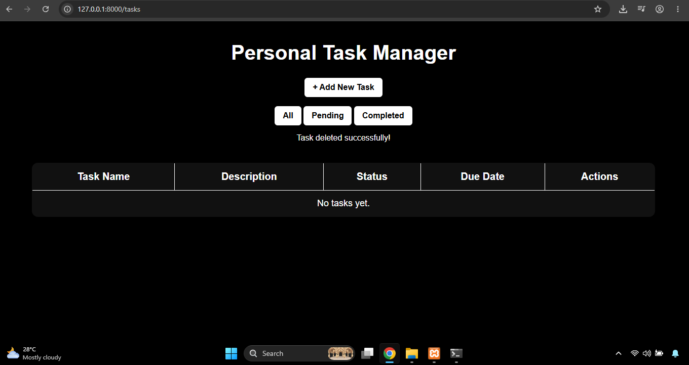
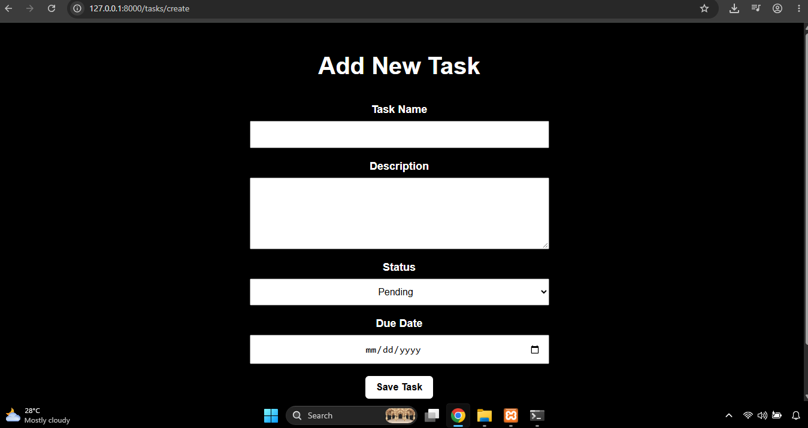
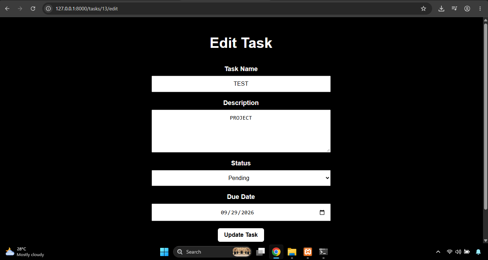
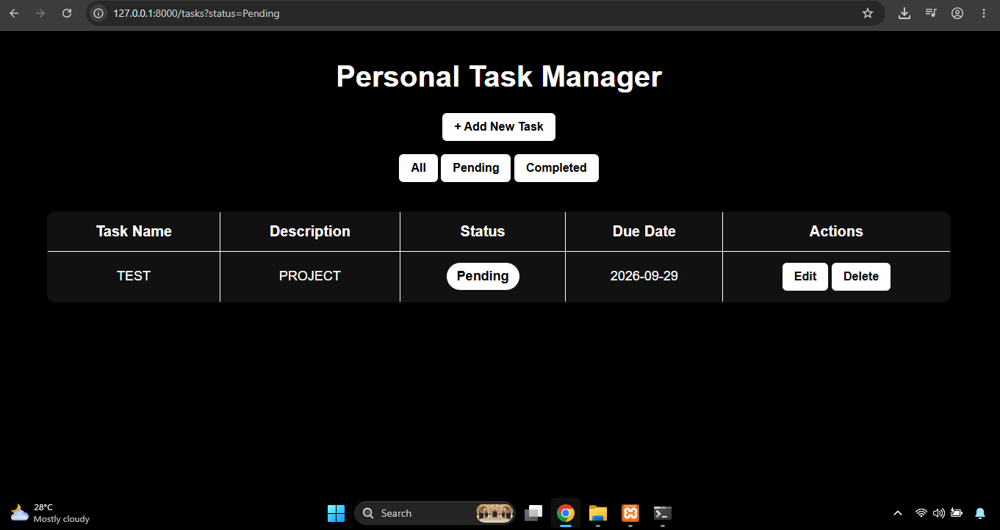
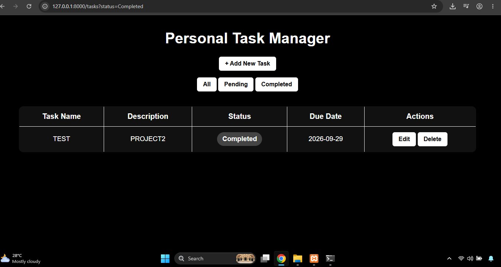

# Personal Task Manager

## Project Code
WST21-PM-2026-SF

## Student Name
GONZAGA, KIM ELIJAH A.

## Course & Year
BSIT 2 SEC 5

## Database Used
MySQL

## Features

### Required Features
- Add Task
- View Tasks
- Edit Task
- Delete Task
- Update Task Status

### Additional Features
- Filter tasks by status (All, Pending, Completed)
- Future-date validation for due dates
- Delete confirmation before removing a task
- Responsive and organized black-and-white interface
- Status badges for Pending and Completed tasks

## Description
A Project Task Manager based on Laravel with CRUD functionality

## Technologies Used
- Laravel
- PHP
- MySQL
- Blade
- HTML
- CSS

## Task Fields
- Task Name
- Description
- Status
- Due Date

## UI Screenshots

### Task Manager

### Add Task

### Edit Task

### Pending Tasks

### Completed Tasks

## System Features

The Personal Task Manager allows users to:

- **Add Task** – Create a new task with a task name, description, status, and due date.
- **View Tasks** – Display all saved tasks in the task list.
- **Edit Task** – Update the information of an existing task.
- **Delete Task** – Remove a task from the task list.
- **Status Filter** – Filter tasks by Pending or Completed status.
- **Due Date Validation** – Prevent users from selecting a past due date.

## Step-by-Step: How to Run the System

### 1. Start XAMPP
Open XAMPP and start:
- Apache
- MySQL

### 2. Open the Project Folder
Open the terminal and navigate to:

E:\Laravel\task-manager

### 3. Start the Laravel Development Server
Run:

php artisan serve

### 4. Open the System
Open a web browser and go to:

http://127.0.0.1:8000/tasks

### 5. Use the Task Manager
From the Task Manager, users can:
- Add new tasks
- View tasks
- Edit existing tasks
- Delete tasks
- Filter tasks by status

